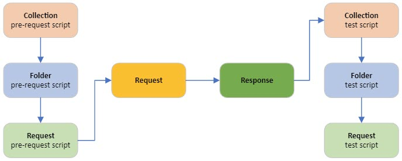

# Postman Examples

## Scripts Execution Order



## Variables

### Scope of variables
  
* Global variables: `pm.globals`
* Collection variables: `pm.environment`
* Environment variables: `pm.collectionVariables`
* Data variables: `pm.iterationData` -- from external CSV and JSON files to define data sets that you can use when running collections
* Local variables

`pm.variables` will use the variables of the closet scope.

### Check required envrionment profile 

The following code will prevent any requests from being executed if the correct environment profile is not chosen. The code needs to be put in the "Pre-request Scripts" section at the collection level.

```javascript
if(pm.environment.name !== "ENV-GOOGLE-API") {
   throw Error("please choose 'ENV-GOOGLE-API' environment profile");
}
```
## Define Global Functions

### Parse JSON Web Token (JWT)

A JWT consists of three components:

```
<header>.<payload>.<signature>
```

To parse, we can define a global function as following function in Pre-request Scripts at Collection level.

```javascript
globalUtil = {
  parseJwt: (token) => {
    try {
        const tokenComponents = token.split('.');
        const header = Buffer.from(tokenComponents[0], 'base64').toString();
        const payload = Buffer.from(tokenComponents[1], 'base64').toString();
        return {"header": JSON.parse(header), "payload": JSON.parse(payload)};
    } catch (e) {
        console.error("error occurred while parsing JWT: " + e);
        return null;
    }
  }
};
```

To invoke:

```javascript
const jwtTokenDecoded = globalUtil.parseJwt(jwtTokenEncoded); // output is a JSON object (not string)
console.log(jwtTokenDecoded);
```

## Common Test Assertions

```javascript
pm.test("HTTP status is OK", function() {
    pm.response.to.have.status(200);
})

let responseJson = pm.response.json();

pm.test("Response body has username", function () {
    pm.expect(responseJson).to.have.property("username");
    pm.expect(responseJson.username).is.to.eql(pm.environment.get("username"));
});

```

### Assert response status and code

```javascript
pm.response.to.have.status(200);
pm.response.to.have.status("OK");
pm.expect(pm.response.code).to.eql(200);
pm.expect(pm.response.code).to.be.oneOf([201,202]);
```

### Assert response body

```javascript
pm.test("response should be okay to process", function () {
    pm.response.to.not.be.error;
    pm.response.to.have.jsonBody("");
    pm.response.to.not.have.jsonBody("error");
});

pm.test("response must be valid and have a body", function () {
     pm.response.to.be.ok;
     pm.response.to.be.withBody;
     pm.response.to.be.json;
});
```

### Assert response body

```javascript
// parse JSON
const responseJson = pm.response.json();
// parse XML
const responseJson = xml2Json(pm.response.text());

pm.expect(pm.response.text()).to.include("customer_id");

pm.expect(responseJson).to.have.proerty("name");

const responseJson = pm.response.json();
pm.expect(responseJson.name).to.eql("Jane");

```

## Test Automation
### Supply static files
Using [node-static](https://www.npmjs.com/package/node-static) to supply static files such as JSON files.

```shell
# serve up the current directory 
$ static
serving "." at http://127.0.0.1:8080
 
# serve up a different directory 
$ static public
serving "public" at http://127.0.0.1:8080
```

## References
* [Postman JavasScript Reference](https://learning.postman.com/docs/writing-scripts/script-references/postman-sandbox-api-reference/)
